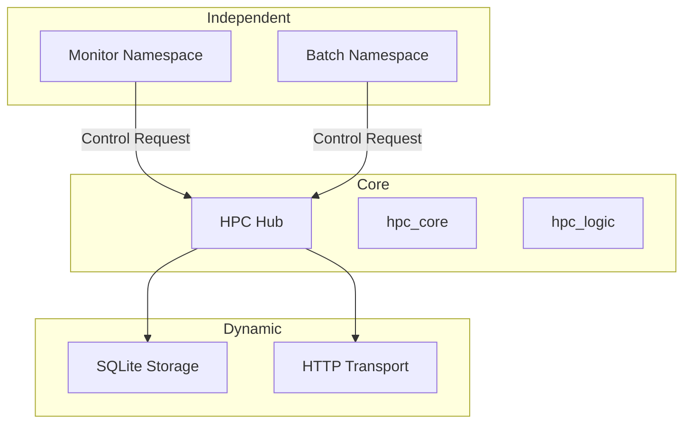

# Distributed HPC System

A modular, lattice-based distributed system for high-performance computing.

## Architecture Classification

### 1. Core Logic (The Kernel)
These crates define the fundamental protocols and state machines of the system.
- `hpc_core`: Shared traits, lattice types, and the universal domain schema (the "Small Kernel").
- `hpc_logic`: The Hub's internal state machine logic, including the delta-join engine.
- `hpc_node`: The bootstrapper binary that provides the CLI and wires the modules together.

### 2. Dynamic Modules (Plugins)
These crates provide concrete implementations for infrastructure and are designed to be swappable.
- `hpc_storage_sqlite`: Persistence layer using SQLite.
- `hpc_transport_http`: Network communication layer using HTTP/Axum.

### 3. Independent Modules (Namespaces & Logic)
These crates are "independent" extensions. They are not part of the Hub's core code and are registered/activated dynamically via Control-Plane requests.

#### Contracts
Independent modules must provide a `NamespaceSpec` and a `GeneratorSpec` to the Hub.

| Module | Namespace ID | WorkSpec (Schema) | WF Logic |
|---|---|---|---|
| `hpc_ns_batch` | `batch` | `command` (String), `cpu` (Int), `memory` (Int) | Required fields presence and type validation. |
| `hpc_resource_monitor` | `monitor` | `cpu_usage` (String), `mem_used_kb` (Int), `mem_total_kb` (Int) | Required fields presence and type validation. |

- `hpc_executor_relay`: Component used by Relays to execute jobs received from the Hub.

## Demo Flow

The system can be demonstrated using the `demo.sh` script, which automates the following steps:
1. Start the Hub.
2. Start a Relay (subscribing to the `batch` namespace).
3. Start a Resource Monitor (reporting to the `monitor` namespace).
4. Submit a batch job to the Hub.

